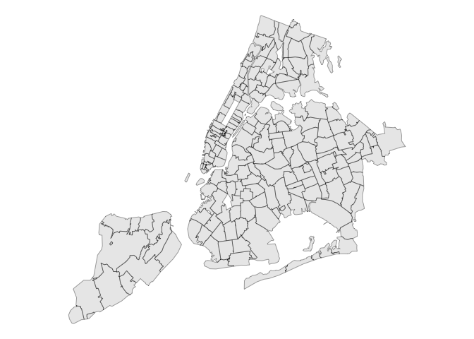

<!-- README.md is generated from README.Rmd. Please edit that file -->

# nyczips 

<!-- badges: start -->

[](https://github.com/kjhealy/nyczips/actions/workflows/R-CMD-check.yaml)
<!-- badges: end -->

Provides a tibble of New YorK City zip codes and a simple features
collection of their ZCTA polygons.

## Installation

You can install the development version of nyczips like so:

``` r
remotes::install_github("kjhealy/nyczips)
```

## Example

``` r
library(tidyverse)
#> ── Attaching core tidyverse packages ──────────────────────── tidyverse 2.0.0 ──
#> ✔ dplyr     1.1.4     ✔ readr     2.1.5
#> ✔ forcats   1.0.1     ✔ stringr   1.6.0
#> ✔ ggplot2   4.0.0     ✔ tibble    3.3.0
#> ✔ lubridate 1.9.4     ✔ tidyr     1.3.1
#> ✔ purrr     1.2.0     
#> ── Conflicts ────────────────────────────────────────── tidyverse_conflicts() ──
#> ✖ dplyr::filter() masks stats::filter()
#> ✖ dplyr::lag()    masks stats::lag()
#> ℹ Use the conflicted package (<http://conflicted.r-lib.org/>) to force all conflicts to become errors
library(sf)
#> Linking to GEOS 3.13.0, GDAL 3.8.5, PROJ 9.5.1; sf_use_s2() is TRUE
library(nyczips)

nyc_zips
#> # A tibble: 255 × 7
#>    zip   borough   city     county          long_county     short_county po_name
#>    <chr> <chr>     <chr>    <chr>           <chr>           <chr>        <chr>  
#>  1 10001 Manhattan New York New York County New York Count… New York     New Yo…
#>  2 10002 Manhattan New York New York County New York Count… New York     New Yo…
#>  3 10003 Manhattan New York New York County New York Count… New York     New Yo…
#>  4 10004 Manhattan New York New York County New York Count… New York     New Yo…
#>  5 10005 Manhattan New York New York County New York Count… New York     New Yo…
#>  6 10006 Manhattan New York New York County New York Count… New York     New Yo…
#>  7 10007 Manhattan New York New York County New York Count… New York     New Yo…
#>  8 10009 Manhattan New York New York County New York Count… New York     New Yo…
#>  9 10010 Manhattan New York New York County New York Count… New York     New Yo…
#> 10 10011 Manhattan New York New York County New York Count… New York     New Yo…
#> # ℹ 245 more rows


nyc_zip_sf
#> Simple feature collection with 212 features and 3 fields
#> Geometry type: MULTIPOLYGON
#> Dimension:     XY
#> Bounding box:  xmin: -74.25609 ymin: 40.4961 xmax: -73.651 ymax: 40.91528
#> Geodetic CRS:  NAD83
#> First 10 features:
#>      zip        name   pop                       geometry
#> 1  11219 ZCTA5 11219 89371 MULTIPOLYGON (((-74.0127 40...
#> 2  10021 ZCTA5 10021 44280 MULTIPOLYGON (((-73.95926 4...
#> 3  10044 ZCTA5 10044 12440 MULTIPOLYGON (((-73.96159 4...
#> 4  11213 ZCTA5 11213 67056 MULTIPOLYGON (((-73.94782 4...
#> 5  11424 ZCTA5 11424     0 MULTIPOLYGON (((-73.83098 4...
#> 6  10005 ZCTA5 10005  8701 MULTIPOLYGON (((-74.01251 4...
#> 7  10311 ZCTA5 10311     0 MULTIPOLYGON (((-74.18058 4...
#> 8  10280 ZCTA5 10280  9496 MULTIPOLYGON (((-74.01949 4...
#> 9  11365 ZCTA5 11365 44738 MULTIPOLYGON (((-73.81416 4...
#> 10 11205 ZCTA5 11205 46843 MULTIPOLYGON (((-73.98022 4...
```

Notice that we have more zip codes in `nyc_zips` than zctas in
`nyc_zip_sf`. Several of these zip codes are for PO Boxes or otherwise
non-residential (like LGA and Fort Totten Park).

``` r
nyc_zip_sf |> 
  filter(pop == 0)
#> Simple feature collection with 28 features and 3 fields
#> Geometry type: MULTIPOLYGON
#> Dimension:     XY
#> Bounding box:  xmin: -74.18246 ymin: 40.60293 xmax: -73.77029 ymax: 40.81133
#> Geodetic CRS:  NAD83
#> First 10 features:
#>      zip        name pop                       geometry
#> 1  11424 ZCTA5 11424   0 MULTIPOLYGON (((-73.83098 4...
#> 2  10311 ZCTA5 10311   0 MULTIPOLYGON (((-74.18058 4...
#> 3  10170 ZCTA5 10170   0 MULTIPOLYGON (((-73.97711 4...
#> 4  11451 ZCTA5 11451   0 MULTIPOLYGON (((-73.79609 4...
#> 5  11359 ZCTA5 11359   0 MULTIPOLYGON (((-73.78123 4...
#> 6  10167 ZCTA5 10167   0 MULTIPOLYGON (((-73.97535 4...
#> 7  10153 ZCTA5 10153   0 MULTIPOLYGON (((-73.97302 4...
#> 8  10177 ZCTA5 10177   0 MULTIPOLYGON (((-73.97652 4...
#> 9  10111 ZCTA5 10111   0 MULTIPOLYGON (((-73.97845 4...
#> 10 10152 ZCTA5 10152   0 MULTIPOLYGON (((-73.97261 4...
```

With all the zips:

``` r
ggplot(nyc_zip_sf) + geom_sf() + theme_void()
```



Without the zero-pops:

``` r
nyc_zip_sf |> 
  filter(pop != 0) |> 
  ggplot() + 
  geom_sf() + 
  theme_void()
```


Zero-pops highlighted:

``` r
nyc_zip_sf |> 
  mutate(empty = ifelse(pop == 0, TRUE, FALSE)) |> 
  ggplot() + 
  geom_sf(aes(fill = empty)) + 
  scale_fill_manual(values = c("white", "red")) +
  theme_void()
```


